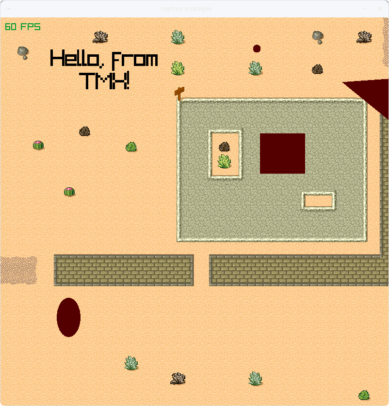

# raytmx

Header-only raylib library for loading and drawing Tiled's TMX tilemap documents. 




## Features

- Portable C99, tested with GCC (Windows and Linux) and MSVC
- Supports external tilesets and object templates
- Supports animations
- Supports parallaxed scrolling of layers when a Camera2D is used
- Supports unencoded tile layer data and Base64- and CSV-encoded data
- Supports tile flipping flags and applies correct transforms
- Supports single-image and collection of images tilesets
- Supports drawing of all object types: ellipse, point, polygon, polyline, text, and tile objects
- Supports word wrapping and all alignment options, including horizontal justification, of text objects

## Limitations

- Only the orthogonal orientation is supported; isometric, staggered, and hexagonal are not
- JSON, which can optionally be used by Tiled, is not currently implemented
- No tile data (de)compression methods are currently implemented
- Wangsets are not implemented
- Infinite maps are not supported and are treated as fixed-size
- Object rotations are parsed but currently ignored when drawing
- Tile object alignment (i.e. placement of tiles when used as objects) is parsed but currently ignored when drawing
- Text drawing is limited to raylib's default font although the desired font is available as a string
- Text drawing does not support bold, italics, underline, or strikeout styling
- Concave polygon objects may not be drawn correctly due to drawing with fan triangulation from the centroid
- Image transparency colors are parsed but their use is not implemented
- Repetition of image layers is not implemented
- Nested <properties> are not supported; they are merged into a single list of properties


## Usage

Define the implementation before including *raytmx*.
``` c
#define RAYTMX_IMPLEMENTATION
#include "raytmx.h"
```
As usual with header-only libraries, the implementation's definition can be limited to just a single file. This will depend on your specific build configuration.

```c
#include <stddef.h> /* NULL */
#include <stdlib.h> /* EXIT_FAILURE, EXIT_SUCCESS */

#include "raylib.h"

#define RAYTMX_IMPLEMENTATION
#include "raytmx.h"

int main(int argc, char **argv) {
    /* This map makes use of many TMX features making it useful for demonstrations. It will be adjacent to the */
    /* executable once built. */
    const char* tmx = "raytmx-example.tmx";

    /* Configure the window with a resolution and title. This example will also target 60 frames per second. */
    const int screenWidth = 1400, screenHeight = 1400;
    const float panSpeed = 150.0f;
    InitWindow(screenWidth, screenHeight, "raytmx example");
    SetTargetFPS(60);

    /* Load the map. If loading fails, NULL will be returned and details will be TraceLog()'d. */
    TmxMap* map = LoadTMX(tmx);
    if (map == NULL)
        return EXIT_FAILURE;

    /* Create a camera for efficient panning and zooming. The initial target will be the center of the map. */
    Camera2D camera;
    camera.zoom = 8.0f;
    camera.target.x = (float)(map->width * map->tileWidth) / 2.0f;
    camera.target.y = (float)(map->height * map->tileHeight) / 2.0f;
    camera.offset.x = (float)screenWidth / 2.0f;
    camera.offset.y = (float)screenHeight / 2.0f;
    camera.rotation = 0.0f;

    while (WindowShouldClose() == false) {
        if (IsKeyDown(KEY_RIGHT))
            camera.target.x += panSpeed * GetFrameTime();
        if (IsKeyDown(KEY_LEFT))
            camera.target.x -= panSpeed * GetFrameTime();
        if (IsKeyDown(KEY_DOWN))
            camera.target.y += panSpeed * GetFrameTime();
        if (IsKeyDown(KEY_UP))
            camera.target.y -= panSpeed * GetFrameTime();

        BeginDrawing();
        {
            ClearBackground(BLACK);
            BeginMode2D(camera);
            {
                AnimateTMX(map);
                DrawTMX(map, &camera, 0, 0, WHITE);
            }
            EndMode2D();
            DrawFPS(10, 10);
        }
        EndDrawing();
    }

    UnloadTMX(map);
    CloseWindow();

    return EXIT_SUCCESS;
}

```


## Dependency

*raytmx* depends on [hoxml](https://github.com/luphi/hoxml) for XML parsing and raylib for its graphical, file system, and time utilities.