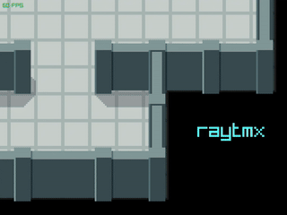

# Basic example

This program demonstrates raytmx's API as simply as possible. As a result, this *may* produce visual artifacts like
lines between tiles. It also lacks any use of collisions objects that are present in the example TMX.

