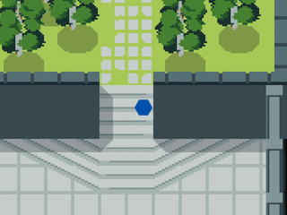

# Collision detection example

This program demonstrates raytmx's collision detection functions. A preprocessor defines which objects are used for
collisions: CHECK_COLLISION_OBJECT_GROUP. When _true_, the program uses the "Walls" object group. When _false_, the
program uses the collision data within the tileset.

A (convex) polygon is used in place of a player character.

