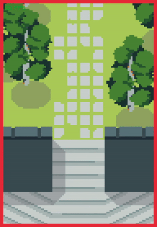

# Smooth camera example

This program demonstrates smooth camera panning without the usual visual artifacts. Without additional steps, cameras 
that pan with floating-point precision often cause tiles to be drawn at non-integer positions occasionally leading to 
rounding and a tile row/column being drawn one pixel away from what was intended. This program includes those 
additional steps.

Note that this program draws the map to a render texture at its native resolution. This means text in the map may be
drawn at an unreasonably low resolution, as seen in the bottom-right corner of the example TMX. In real use, maps with
text should use layers to separate high-resolution text from low-resolution tiles and should be drawn separately.

